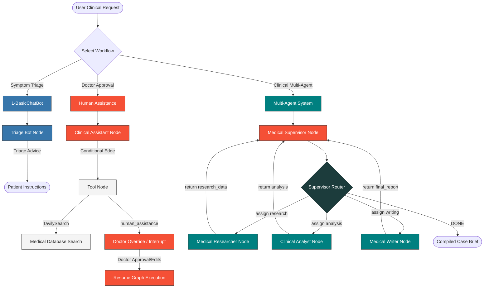
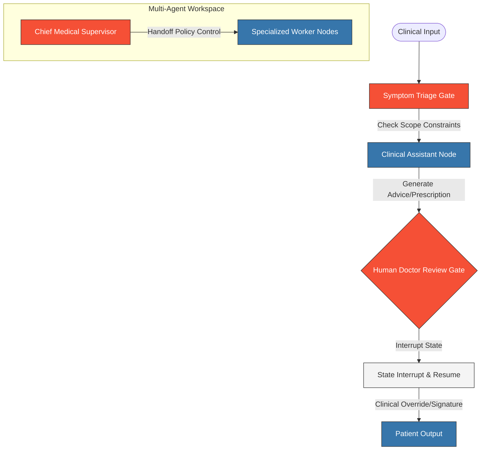
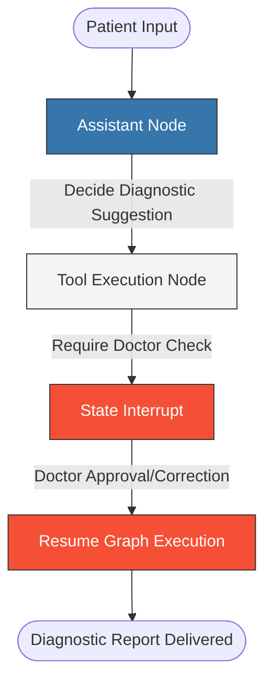
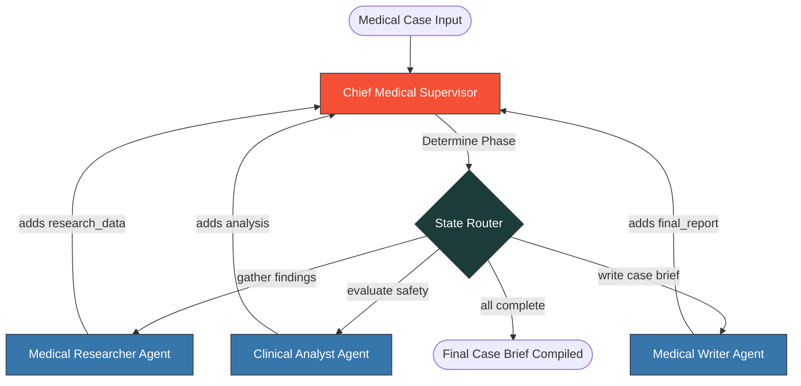

<div align="center">

# LangGraph Healthcare AI Agent Suite

### Stateful Symptom Triage, Human-in-the-Loop Doctor Verification & Multi-Agent Clinical Research Orchestrator

[](https://python.org)
[](https://langchain.com)
[](https://langchain-ai.github.io/langgraph/)
[](https://groq.com)
[](https://tavily.com)

An enterprise-grade agentic workspace applying LangGraph and LangChain to healthcare assistant design patterns. Features three distinct architectural clinical patterns: basic symptom triage conversation, human-in-the-loop clinical decision support with manual doctor overrides, and supervisor-supervised multi-agent systems for medical risk analysis and research report generation.

<br />

[](#how-it-works)
[](#getting-started)
[](#the-workflows)

</div>

---

## How It Works

This repository contains independent modules built on top of LangGraph's state machine execution model. Each module is contextualized around a critical healthcare application, demonstrating how state management, loops, and human-in-the-loop workflows operate in high-integrity domains.

<details>
<summary><b>View Healthcare AI Agent Suite Flow Diagram</b></summary>



</details>

## Clinical Safety Guardrails & Verification Architecture

Because clinical safety and accurate guidance are the primary objectives of this agent suite, a multi-tiered safety guardrails architecture is implemented across the graph designs:



### 🛡️ Safety Rail Design Mappings

1. **Symptom Triage Gate (Input Guardrails)**
   - **Mechanism**: System prompts strictly forbid the triage chatbot from diagnosing conditions or prescribing medications.
   - **Boundary**: Limits assistant behavior to query collection and clinic routing recommendations.

2. **Doctor Verification Gate (Human-in-the-Loop Resumption)**
   - **Mechanism**: Suspends the thread execution using LangGraph `interrupt` when medical prescriptions or specific diagnosis labels are detected.
   - **Boundary**: The state is serialized to a persistent database checkpoint, preventing user disclosure until a licensed medical professional reviews and reschedules the state.

3. **Supervisor Handoff Policy Control (Structured Delegation)**
   - **Mechanism**: The supervisor enforces separation of concerns by reading custom variables (`has_research`, `has_analysis`, `has_report`).
   - **Boundary**: Prevents downstream agents from executing tasks out-of-order or accessing tools outside their clinical scope.

---

## Key Features

- **Clinical Symptom Triage** — Conversational flows for gathering patient symptoms, history, and concerns using `groq:llama-3.3-70b-versatile` inside a LangGraph `StateGraph`.
- **Human-in-the-Loop Verification** — Ensures patient safety by interrupting execution when prescription or diagnostic outputs are generated, allowing a licensed doctor to review, override, and resume the graph run.
- **Hierarchical Medical Supervision** — Coordinated team of specialized agents led by a Chief Medical Supervisor who evaluates variables dynamically to route research, data analysis, and documentation.
- **Fact-Based Medical Grounding** — Integration of Tavily search engines to retrieve peer-reviewed medical publications, clinical guidelines, and drug database specs.
- **State Persistence & Checkpointers** — Full context-aware memory retention for conversational histories and doctor overrides via `MemorySaver`.

## Tech Stack

<table>
  <thead>
    <tr>
      <th>Layer</th>
      <th>Technology</th>
      <th>Description</th>
    </tr>
  </thead>
  <tbody>
    <tr>
      <td><strong>State Orchestration</strong></td>
      <td>
        <a href="https://langchain-ai.github.io/langgraph/">
          
        </a>
      </td>
      <td>Manages patient state, conditional clinical paths, node interrupts, and checkpointer states.</td>
    </tr>
    <tr>
      <td><strong>Agent Abstraction</strong></td>
      <td>
        <a href="https://langchain.com">
          
        </a>
      </td>
      <td>Decoupled LLM schemas, doctor-override tool decorators, clinical prompts, and unified chat initialization.</td>
    </tr>
    <tr>
      <td><strong>Inference Engine</strong></td>
      <td>
        <a href="https://groq.com">
          
        </a>
      </td>
      <td>High-speed clinical reasoning using Groq Cloud Llama-3.3-70B model.</td>
    </tr>
    <tr>
      <td><strong>Grounding Engine</strong></td>
      <td>
        <a href="https://tavily.com">
          
        </a>
      </td>
      <td>Queries medical journals, drug databases, and clinical trials for context-aware grounding.</td>
    </tr>
    <tr>
      <td><strong>Clinical Persistence</strong></td>
      <td>
        <a href="https://github.com/langchain-ai/langgraph">
          
        </a>
      </td>
      <td>Enforces hard state checkpoints to enable pauses for clinical doctor override and safety checks.</td>
    </tr>
  </tbody>
</table>

## Project Structure

```
.
├── 1-BasiChatBot/
│   └── 1-basicchatbot.ipynb      # Basic patient triage and dialogue graph
├── HumanAssitance/
│   └── HumaninLoop.ipynb         # Doctor-in-the-loop safety interrupt & review node
├── MultiAgents/
│   └── Agents.ipynb              # Medical Supervisor, Researcher, Analyst & Writer team
├── main.py                       # Global entrypoint script
├── pyproject.toml                # UV tool configuration & dependency specifications
├── requirements.txt              # Standard requirements file
├── .env                          # API secrets (GROQ & TAVILY)
└── README.md                     # Healthcare suite documentation
```

## Getting Started

### Prerequisites

- Python 3.13+
- A Groq API Key (get one from [console.groq.com](https://console.groq.com))
- A Tavily API Key (get one from [tavily.com](https://tavily.com))

### Installation

```bash
# Clone the repository
git clone https://github.com/your-username/langgraph-healthcare-agents.git
cd langgraph-healthcare-agents

# Create and activate a virtual environment
python -m venv .venv
source .venv/bin/activate  # On Windows: .venv\Scripts\activate

# Install dependencies using uv (recommended)
uv pip install -r requirements.txt
# Or using standard pip:
pip install -r requirements.txt
```

### Configuration

Create a `.env` file in the root of the project to configure your credentials:

```env
GROQ_API_KEY=your_groq_api_key_here
TAVILY_API_KEY=your_tavily_api_key_here
```

---

## The Workflows

### 1. Basic Patient Triage Assistant
Located in [1-basicchatbot.ipynb](file:///Users/chokkaraketankumar/Desktop/Agentic%20Ai%20/Langraph-agentic-ai/1-BasiChatBot/1-basicchatbot.ipynb), this workflow configures a symptom collection and triage chat bot. The conversational agent prompts patients for symptom profiles, timeline, and intensity before offering routing suggestions (e.g., advising ER vs. primary care clinic visits).

### 2. Human-in-the-Loop Clinical Verification
Located in [HumaninLoop.ipynb](file:///Users/chokkaraketankumar/Desktop/Agentic%20Ai%20/Langraph-agentic-ai/HumanAssitance/HumaninLoop.ipynb), this workflow implements strict human oversight safeguards.
When the AI proposes diagnostic summaries or treatment suggestions, the system calls a `human_assistance` tool which registers an `interrupt` state.



> [!CAUTION]
> **Safety Critical Boundary**
> No diagnosis, prescription, or clinical guidance is ever surfaced to the user output before state resumption. A licensed practitioner must approve the clinical output.

### 3. Multi-Agent Medical Supervisor Team
Located in [Agents.ipynb](file:///Users/chokkaraketankumar/Desktop/Agentic%20Ai%20/Langraph-agentic-ai/MultiAgents/Agents.ipynb), this notebook implements a hierarchical clinical workspace. A **Chief Medical Supervisor** coordinates a team of specialized agents, dynamically updating routing based on case state variables.



> [!NOTE]
> **SupervisorState Definition**
> The state of the clinical supervisor model is tracked using custom schema definitions:
> ```python
> class SupervisorState(MessagesState):
>     next_agent: str      # Tracks routing targets (researcher/analyst/writer/end)
>     research_data: str   # Gathers clinical study results and literature checks
>     analysis: str        # Evaluates drug interaction risks and diagnostic flags
>     final_report: str    # Houses the finalized case brief compiled by the writer
>     task_complete: bool  # Signal flag to trigger END
>     current_task: str    # Stores original patient case file metadata
> ```

---

## Customization

The medical agent suite is designed to be highly modular and extensible. You can adapt it to any clinical domain:

| Component | Target File | Modification Details |
|:---|:---|:---|
| **Change LLM Model** | [pyproject.toml](file:///Users/chokkaraketankumar/Desktop/Agentic%20Ai%20/Langraph-agentic-ai/pyproject.toml) / Jupyter Notebooks | Modify `init_chat_model("groq:llama-3.3-70b-versatile")` parameters in notebooks to target different clinical fine-tunes. |
| **Alter Supervisor Logic** | [Agents.ipynb](file:///Users/chokkaraketankumar/Desktop/Agentic%20Ai%20/Langraph-agentic-ai/MultiAgents/Agents.ipynb) | Edit prompt templates inside `create_supervisor_chain` to enforce strict compliance guidelines (e.g. HIPAA standards). |
| **Add Specialized Agents** | [Agents.ipynb](file:///Users/chokkaraketankumar/Desktop/Agentic%20Ai%20/Langraph-agentic-ai/MultiAgents/Agents.ipynb) | Add new nodes (e.g. `pharmacist_agent` for drug interactions) and update `router` Literal endpoints. |
| **Configure Local DB Checkpointing** | [HumaninLoop.ipynb](file:///Users/chokkaraketankumar/Desktop/Agentic%20Ai%20/Langraph-agentic-ai/HumanAssitance/HumaninLoop.ipynb) | Replace in-memory checkpointer (`MemorySaver`) with persistent SQLite or Postgres savers for production clinical session tracking. |

---

## Acknowledgments

- [Model Context Protocol (MCP)](https://modelcontextprotocol.io) for standardizing application-tool interaction.
- [LangGraph Documentation](https://langchain-ai.github.io/langgraph/) for state graph architecture and patterns.
- [Groq Cloud](https://groq.com) for high-performance Llama 3.3 model inference.

---